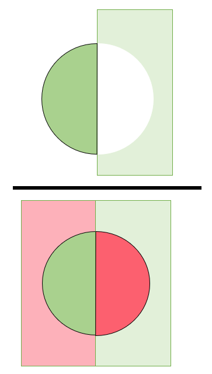
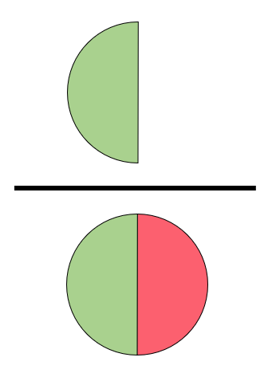
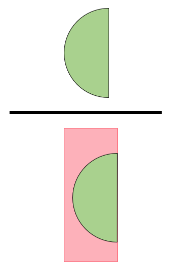

# Surgical Phase Recognition Metrics

To provide a quantitative measure of the performance of the surgical phase predictions, we utilize the metrics of Accuracy, Overall accuracy, Precision, Sensitivity, F1, Jaccard Index (IoU), Specificity, Overlap Score, Matthews Correlation Coefficient (MCC) and Cohen's Kappa.

<p align="center">
    <br>
    <sub><sup>Figure 1: Metrics <a href="https://github.com/ClementPla/SegmentationMetricTutorial/tree/main/src/assets/images">[1]</a></sup></sub>
</p>

**True Positive (TP)** : A test result that correctly indicates the presence of a condition or characteristic [2].<br>
**True Negative (TN)** : A test result that correctly indicates the absence of a condition or characteristic [2].<br>
**False Positive (FP)** : A test result which wrongly indicates that a particular condition or attribute is present [2].<br>
**False Negative (FN)** : A test result which wrongly indicates that a particular condition or attribute is absent [2].<br>

### Micro Average Score

The Micro average score is calculated from the individual classes’ true positives (TPs), true negatives (TNs), false positives (FPs), and false negatives (FNs) of the model. Micro average gives more weight to the majority class and is particularly useful when the classes are imbalanced [3].

### Macro Average Score

Macro average, on the other hand, calculates the performance of each class individually and then takes the unweighted mean of the class-wise performance. Macro average gives equal weight to each class and is useful when all classes are of equal importance [3].

### Macro-weighted Average Score

Macro-weighted scoring takes a weighted mean of the measures. The weights for each class are the total number of samples of that class [6].

The difference between **macro** and **micro averaging** is that macro averaging gives equal weight to each category while micro averaging gives equal weight to each sample. If we have the same number of samples for each class, both macro and micro will provide the same score [9].
### Accuracy

Accuracy returns an overall measure of how much the model is correctly predicting on the entire set of data. It is one of the most popular metrics in multi-class classification and it is directly computed from the confusion
matrix [4].

<p align="center">
    <br>
    <sub><sup>Figure 2: Accuracy <a href="https://github.com/ClementPla/SegmentationMetricTutorial/tree/main/src/assets/images">[1]</a></sup></sub>
</p>

```math
\frac{TP + TN}{TP + TN + FP + FN}
```

The formula of the Accuracy considers the sum of True Positive and True Negative elements at the numerator and the
sum of all the entries of the confusion matrix at the denominator. True Positives and True Negatives are the elements
correctly classified by the model and they are on the main diagonal of the confusion matrix, while the denominator also
considers all the elements out of the main diagonal that have been incorrectly classified by the model [4].

### Overall Accuracy

Accuracy returns an overall measure of how much the model is correctly predicting on the entire set of data [4].

```math
\frac{\text{Number of correct predictions}}{\text{Total number of predictions}}
```

### Precision

Precision refers to the percentage of units in our model's predictions that are classified as Positive and are actually Positive. This means that Precision provides us with an understanding of the model's reliability in identifying an individual as Positive [4].

Macro Average Precision and Recall are simply computed as the arithmetic mean of the metrics for single classes [4].

<p align="center">
    <br>
<sub><sup>Figure 3: Precision <a href="https://github.com/ClementPla/SegmentationMetricTutorial/tree/main/src/assets/images">[1]</a></sup></sub>
</p>

```math
\frac{TP}{TP+FP}
```

#### Micro Precision

The micro average precision is the sum of all true positives divided by the sum of all true positives and false positives. In other words, we divide the number of correctly identified predictions by the total number of predictions [9].

```math
\frac{TP_1 + TP_2 + TP_3 + ... + TP_n}{TP_1 + TP_2 + TP_3 + ... + TP_n+FP_1 + FP_2 + FP_3 + ... + FP_n}
```

#### Macro Precision

The macro average precision is the arithmetic mean of all the precision values for the different classes [9].

```math
\frac{Prec_1 + Prec_2 + ... + Prec_n}{n}
```

n is the total number of classes.


### Sensitivity

The Recall measures the model’s predictive accuracy for the positive class: intuitively, it measures the ability of the
model to find all the Positive units in the dataset [4].

<p align="center">
    <br>
    <sub><sup>Figure 4: Sensitivity <a href="https://github.com/ClementPla/SegmentationMetricTutorial/tree/main/src/assets/images">[1]</a></sup></sub>
</p>

```math
\frac{TP}{TP+FN}
```

#### Micro Sensitivity

The micro average recall is the sum of true positives for all classes divided by actual positives (rather than predicted positives).

```math
\frac{TP_1 + TP_2 + TP_3 + ... + TP_n}{TP_1 + TP_2 + TP_3 + ... + TP_n+FN_1 + FN_2 + FN_3 + ... + FN_n}
```

#### Macro Sensitivity

The macro average recall is the arithmetic mean of all recall scores for different classes.

```math
\frac{Recall_1 + Recall_2 + ... + Recall_n}{n}
```

### F1 Score

The formula of F1-score can be interpreted as a weighted average between Precision and Recall, where F1-score reaches
its best value at 1 and worst score at 0. The relative contribution of precision and recall are equal onto the F1-score and
the harmonic mean is useful to find the best trade-off between the two quantities.  Such metrics may have two different specifications,
giving rise to two different metrics: Micro F1-Score and Macro F1-Score [5].

#### Micro F1-Score

In order to obtain Micro F1-Score, we need to compute Micro-Precision and Micro-Recall before.

The idea of Micro-averaging is to consider all the units together, without taking into consideration possible differences
between classes [5]. Therefore, the Micro-Average Precision and Micro-Average Recall are computed as follows:

```math
\frac{\text{2$\times$Precision$\times$Sensitivity }}{\text{Precision + Sensitivity}}
```

#### Macro F1-Score

In order to obtain Macro F1-Score, we need to compute Macro-Precision and Macro-Recall before. They are respectively
calculated by taking the average precision for each predicted class and the average recall for each actual class. Hence,
the Macro approach considers all the classes as basic elements of the calculation: each class has the same weight in the
average, so that there is no distinction between highly and poorly populated classes [5].

Macro F1-Score for each class is the harmonic mean of Macro-Precision and Macro-Recall for each class. Eventually, Macro F1-Score is the average of per class F1 score [5].

```math
\frac{1}{K} \sum_{i=1}^{K} {F}_{i}
```

### Specificity

The specificity indicates the proportion of negative samples that are correctly predicted as negative. It is also known as True Negative Rate (TNR) [4].

<p align="center">
    <br>
    <sub><sup>Figure 5: Specificity <a href="https://github.com/ClementPla/SegmentationMetricTutorial/tree/main/src/assets/images">[1]</a></sup></sub>
</p>

```math
\frac{TN}{TN+FP}
```

### Jaccard Index (IoU)

The Jaccard Index, also known as the Jaccard similarity coefficient, is a statistic used in understanding the similarities between sample sets. The measurement emphasizes similarity between finite sample sets, and is formally defined as the size of the intersection divided by the size of the union of the sample sets [8].<br>

<p align="center">
    <br>
    <sub><sup>Figure 6: IoU <a href="https://deepai.org/machine-learning-glossary-and-terms/jaccard-index">[9]</a></sup></sub>
</p>

The mathematical representation of the index is written as:

```math
\frac{|P \cap G| }{ |P \cup G|} 
```

### Overlap Score

This score measures overlap between groundtruth and prediction. It is a function of the longest contiguous predicted segment for a given ground
truth segment [7].

```math
\frac{1}{N} \sum_{i=1}^{N} \max_{j} \frac{\left| y_i \cap \hat{y_j}\right|}{\left| y_i \cup \hat{y_j}\right|}
```

### Matthews Correlation Coefficient (MCC)

The MCC has a scale that ranges from -1 to 1, where values near 1 suggest highly accurate predictions with a strong positive correlation between the predicted and true labels. This implies that the predicted values are very likely to match the actual classification. Conversely, when the MCC equals 0, there is no correlation between the variables, indicating that the classifier randomly assigns units to classes without regard for their true values.
In some cases, MCC can be negative, indicating an inverse relationship between the predicted and true classes [4].

```math
\frac{\text{c} \times \text{s} - \sum p_{k} \times t_{k}}{\sqrt{(s^2 - \sum p^2_{k})(s^2 - \sum t^2_{k})}}
```


$\sum C_{kk} \hspace{1cm} \text{the total number of elements correctly predicted}$ <br>
$\sum \sum C_{ij} \hspace{1cm} \text{the total number of elements}$ <br>
$\sum C_{ki} \hspace{1cm} \text{the number of times that class k was predicted (column total)}$ <br>
$\sum C_{ik} \hspace{0.2cm} \text{the number of times that class k truly occurred (row total)}$ <br>

### Cohen's Kappa

Cohen's Kappa measures the concordance between the predicted and true labels, regarding them as two random categorical variables.In the multi-class case, the calculation of Cohen’s Kappa Score changes its structure and it becomes more similar to
Mattheus Correlation Coefficient [4].

```math
\frac{p_{agree} - p_{chance}}{1 - p_{chance}}
```

### References
[1]Clement Pla. (2022). Segmentation Metric Tutorial. GitHub repository. <a href="https://github.com/ClementPla/SegmentationMetricTutorial/tree/main/src/assets/images">[source]</a><br>
[2] Wikipedia contributors. (2023, March 15). Confusion matrix. In Wikipedia, The Free Encyclopedia.
<a href="https://en.wikipedia.org/wiki/Confusion_matrix">[source]</a><br>
[3] Krystian Safjan. (2023). Micro and Macro Averages in Multiclass Multilabel Problems. Creative Commons Attribution-ShareAlike.
<a href="https://safjan.com/micro-and-macro-averages-in-multiclass-multilabel-problems/">[source]</a><br>
[4] Margherita Grandini. Metrics For Multi-Class Classification: An Overview. 2020. 2020.<br>
[5] Yutaka Sasaki et al. The truth of the f-measure. 2007. 2007.<br>
[6] Joydwip Mohajon. (2020). Confusion Matrix for Your Multi-Class Machine Learning Model. Towards Data Science.
<a href="https://towardsdatascience.com/confusion-matrix-for-your-multi-class-machine-learning-model-ff9aa3bf7826#:~:text=Specificity%3A%20It%20tells%20you%20what,recall%20into%20a%20single%20measure">[source]</a><br>
[7] C. Lea, R. Vidal and G. D. Hager. Learning convolutional action primitives for fine grained action recognition. in 2016 IEEE International Conference on Robotics and Automation (ICRA). May 2016. pp. 1642–1649.<br>
[8] Adrian Rosebrock . (2016). Jaccard Index. DeepAI.
<a href="https://deepai.org/machine-learning-glossary-and-terms/jaccard-index">[source]</a><br>
[9] Arslan Tariq . (2023). What is the difference between micro and macro averaging?. Educative.
<a href="https://www.educative.io/answers/what-is-the-difference-between-micro-and-macro-averaging">[source]</a><br>
